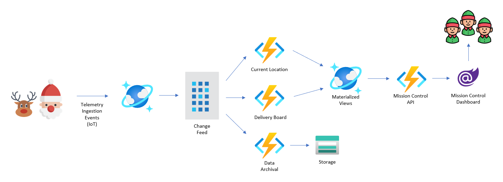

# Festive Tech Calendar 2021 - Cosmos DB Change Feed

  

# Event Sourcing with Azure Cosmos DB Change Feed and Azure Functions

Help the elves track every event that happens this holiday season.

The change feed in Azure Cosmos DB is one of the most overlooked features of Microsoft’s globally distributed, massively scalable, multi-model database service. Similar to the transaction log of a relational database, the change feed is a persistent record of changes to a container in the order they occurred. It therefore serves as an excellent event source for a wide range of cloud-based microservices targeting ecommerce, IoT, and other large-scale scenarios.

## Reference Application - Santa Tracker

  

- Ingest telemetry of Santa's location into Cosmos DB
- Consume the Cosmos DB Change with multiple microservices (Azure Functions):
  - Current Location (materialized view)
  - Delivery Board (materialized view)
  - Archive Data (move data to Azure Storage)
- Mission Control Blazor dashboard to keep an eye on everything

### Technologies

- Cosmos DB (SQL API)
- Cosmos DB Change Feed
- Azure Functions
- Azure Storage
- .NET 6.0
- Blazor WebAssembly
- Latest Azure SDKs

## References

- [Festive Tech Calendar](https://festivetechcalendar.com/)
- [Cosmos DB](https://docs.microsoft.com/en-us/azure/cosmos-db/)
- [Cosmos DB Change Feed](https://docs.microsoft.com/en-us/azure/cosmos-db/change-feed)
- [Materialized View pattern](https://docs.microsoft.com/en-us/azure/architecture/patterns/materialized-view)
- [Azure Functions](https://docs.microsoft.com/en-us/azure/azure-functions/)

### Special Thanks

I would like to thank [Leonard Lobel](https://twitter.com/@lennilobel) for his Cosmos DB Change Feed microservice flight tracking demo as inspiration for my Santa Tracker demo.

